# aind-watchdog-service

[](LICENSE)

[](https://github.com/semantic-release/semantic-release)


# Summary

With aind-watchdog-service, you can configure a directory for the app to watch, where manifest files (or beacon files) are dropped containing src files from an acquisition labeled by modality. The program can be configured with a web-hook URL to send messages to a Teams channel when data staging is complete and data transfer has been triggered through [aind-data-transfer-service](https://github.com/AllenNeuralDynamics/aind-data-transfer-service). Pipeline capsule ids can be added if triggering pipelines is necessary post-acquisition.

# Usage
* There are two options for configuring the watchdog service.
    * Create a watch_config file as yaml. Create an environment variable called WATCH_CONFIG containing the location of the config file.
    * Review src/aind-watchdog-service/models/watch_config.py for configuration parameters
    * watch_config.yml must include:
        * **flag_dir**: directory watchdog observer will monitor for manifest files
        * **manifest_complete**: where watchdog will place completed manifest files
        * **webhook_url**: to receive Teams notifications **OPTIONAL**
    * Run the command line interface to execute the the service. For options pass the -h parameter.

* Manifest files must be saved as yaml and contain *manifest* in the file name. The manifest file must contain the following keys *optional keys are marked as such*:

    * **name**: name of directory for the dataset stored on VAST
    * **processor_full_name**: full name of the person who acquired the data
    * **subject_id**: mouse id
    * **acquisition_datetime**: datetime of when data were acquired
    * **platform**: platform name as defined in aind-data-schema-models
    * **modalities**: modality name with source files or directories listed per modality
    * **project_name**: project name as seen in the project and funding sources smart sheet
    * **schemas**: location of rig.json, session.json and data_description.json
    * **s3_bucket**: private, public or scratch
    * **schedule_time**: when to schedule the transfer pipeline. Defaults to immediately if not set **OPTIONAL**
    * **capsule_id**: Code Ocean pipeline or capsule id to trigger **OPTIONAL**
    * **mount**: Code Ocean pipeline or capsule id mount point **OPTIONAL**

**If you are specifying a capsule id to run a pipeline, you must input the data name of the data mounted to the pipeline. If it is not specified, CO will run the asset mounted to the pipeline and not the dataset that was uploaded.**

# Windows System Installation

* Install (copy) exe to the desired location _As_ of 7/1 - exe is temporarily located here //allen/aind/scratch/ariellel/aind-watchdog-service.exe*
* Create a directory where manifest files will be dropped
* Create a watch_config.yaml file.
* Add watch_config.yaml path to env var titled WATCH_CONFIG
* Create a scheduled task (see below)
* Start watchdog through the created task
* Check Task Manager to verify watchdog is running

# Configure Task Scheduler to control and monitor aind-watchdog-service

**Windows Task Scheduler** 
*Pre-requisites: Must be logged in as a user with admin privileges or logged in under the service account. If you are logged in under the service account and that is the only account that runs on the computer, you will not need to configure this task for all users*
* Select the windows button, type in Task Scheduler and run program
* Highlight Task Scheduler Library in the left panel. In the right panel select New Folder and create a new folder called AIND
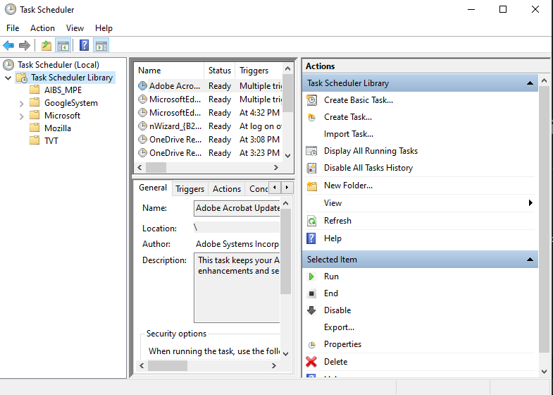
* Right click on the AIND folder and select Create Task...

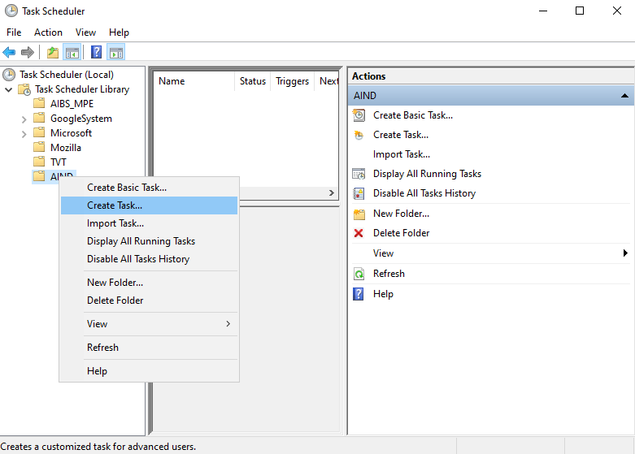

* Update the first panel by creating a name for the scheduled task with a description. Select Run whether user is logged on or not. Select Run with highest priviliges

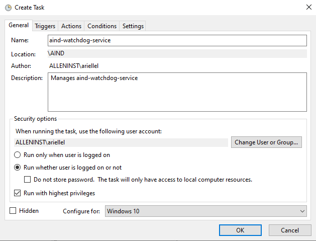
* Go to the Triggers panel and create two new triggers. One will start aind-watchdog-service at start up and the other will start it at user log on. Replicate the panels shown below to configure these two triggers.

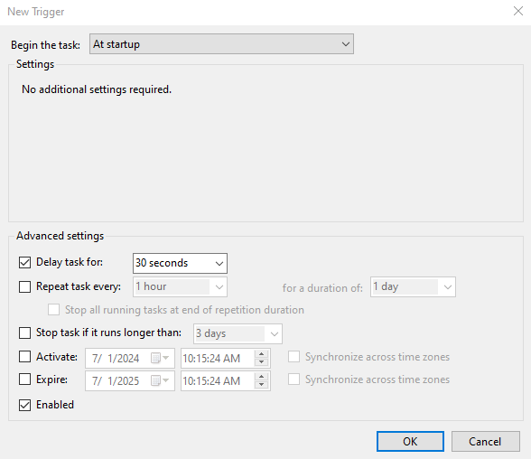

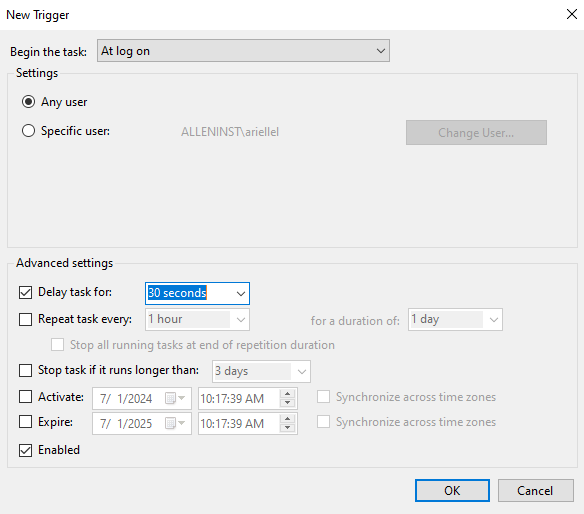

* **Notice the delay time for each task. This is necessary so that Windows boot order does not accidentally miss the task**

* This final trigger panel should look like this:

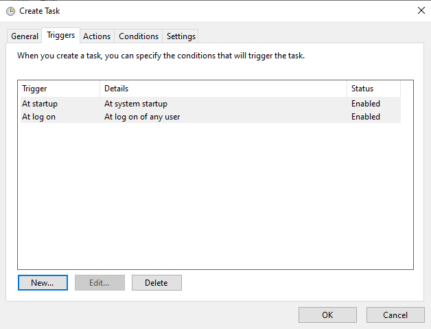

* The Actions panel is where the action is set to start aind-watchdog-service. Be sure to specify the location of your local .exe copy of aind-watchdog-service.

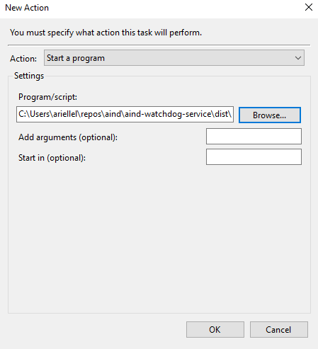

* The final Action panel should look like this

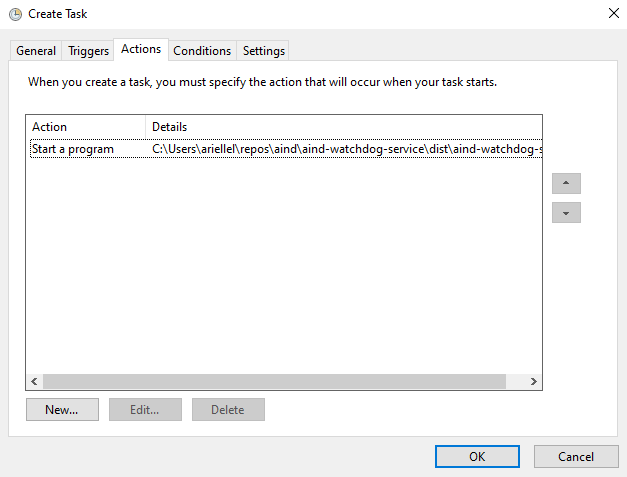

* Because we have specified the task to run for all users, you will be asked to enter your credentials. *The credentials you enter should be for an account with admin priviliges. If you are not logged in as the correct account you will need to log out and log back in as an authorized user and restart the process*

* After entering the user credentials you may be kicked out of the scheduled task. If that happens, right-click on the scheduled task called aind-watchdog-service and select properties to continue configuring the task (skip this step if you did not get kicked off)

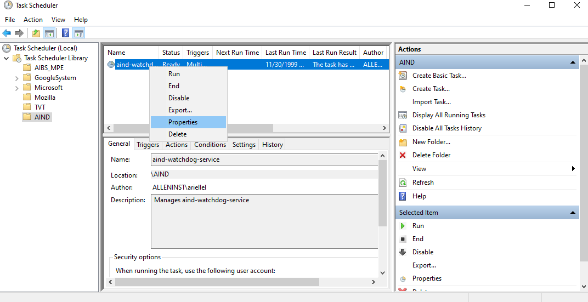

* Select the Settings panel and uncheck Stop the task if it runs longer than. You do not want aind-watchdog-service to get clobbered by the system. Make sure the Settings panel looks exactly as shown below

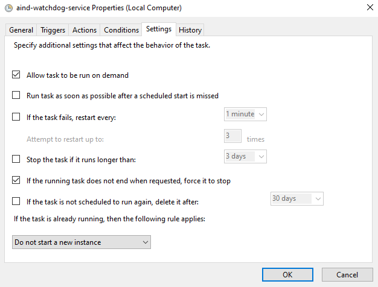

* You may have to enter the user credentials again.

* Once the task is configured, select okay to enter the main Task Scheduler Panel. You will now be able to start the task through Task Scheduler by selecting Run in the left panel of the main UI

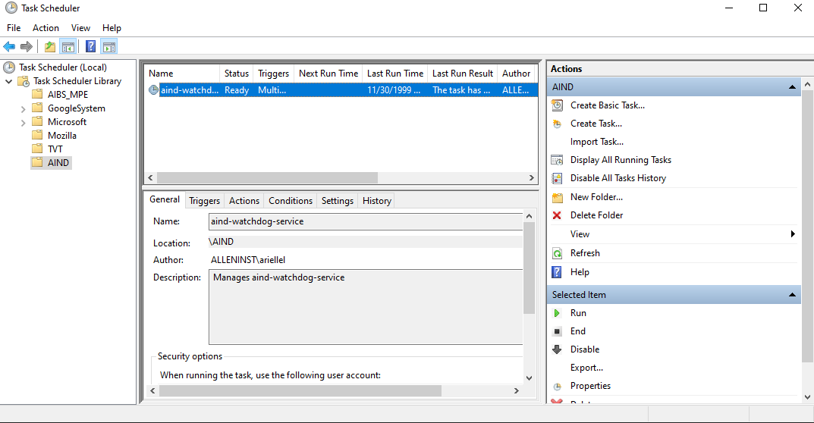

* After selecting Run open Task Manager to verify that two icons of watchdog are active. This is only one instance but the Observer in aind-watchdog-service creates a second thread making it appear that two instances are running.
* To stop aind-watchdog-service, go to the main UI where you selected Run and select End. You should see the task stop in Task Manager. *Task scheduler doesn't always hold onto the second process thread. You may have to end that task manually through Task Manager before restarting a new instance in Task Scheduler*


# Installation
To use the software, in the root directory, run
```bash
pip install -e .
```

To develop the code, run
```bash
pip install -e .[dev]
```

## Contributing

### Linters and testing

There are several libraries used to run linters, check documentation, and run tests.

- Please test your changes using the **coverage** library, which will run the tests and log a coverage report:

```bash
coverage run -m unittest discover && coverage report
```

- Use **interrogate** to check that modules, methods, etc. have been documented thoroughly:

```bash
interrogate .
```

- Use **flake8** to check that code is up to standards (no unused imports, etc.):
```bash
flake8 .
```

- Use **black** to automatically format the code into PEP standards:
```bash
black .
```

- Use **isort** to automatically sort import statements:
```bash
isort .
```

### Pull requests

For internal members, please create a branch. For external members, please fork the repository and open a pull request from the fork. We'll primarily use [Angular](https://github.com/angular/angular/blob/main/CONTRIBUTING.md#commit) style for commit messages. Roughly, they should follow the pattern:
```text
<type>(<scope>): <short summary>
```

where scope (optional) describes the packages affected by the code changes and type (mandatory) is one of:

- **build**: Changes that affect build tools or external dependencies (example scopes: pyproject.toml, setup.py)
- **ci**: Changes to our CI configuration files and scripts (examples: .github/workflows/ci.yml)
- **docs**: Documentation only changes
- **feat**: A new feature
- **fix**: A bugfix
- **perf**: A code change that improves performance
- **refactor**: A code change that neither fixes a bug nor adds a feature
- **test**: Adding missing tests or correcting existing tests

### Semantic Release

The table below, from [semantic release](https://github.com/semantic-release/semantic-release), shows which commit message gets you which release type when `semantic-release` runs (using the default configuration):

| Commit message                                                                                                                                                                                   | Release type                                                                                                    |
| ------------------------------------------------------------------------------------------------------------------------------------------------------------------------------------------------ | --------------------------------------------------------------------------------------------------------------- |
| `fix(pencil): stop graphite breaking when too much pressure applied`                                                                                                                             | ~~Patch~~ Fix Release, Default release                                                                          |
| `feat(pencil): add 'graphiteWidth' option`                                                                                                                                                       | ~~Minor~~ Feature Release                                                                                       |
| `perf(pencil): remove graphiteWidth option`<br><br>`BREAKING CHANGE: The graphiteWidth option has been removed.`<br>`The default graphite width of 10mm is always used for performance reasons.` | ~~Major~~ Breaking Release <br /> (Note that the `BREAKING CHANGE: ` token must be in the footer of the commit) |

### Documentation
To generate the rst files source files for documentation, run
```bash
sphinx-apidoc -o doc_template/source/ src 
```
Then to create the documentation HTML files, run
```bash
sphinx-build -b html doc_template/source/ doc_template/build/html
```
More info on sphinx installation can be found [here](https://www.sphinx-doc.org/en/master/usage/installation.html).
